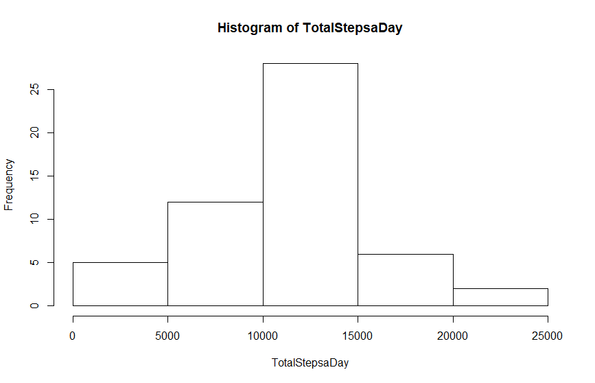

# Report of Peer Assessment 1

# Loading and preprocessing the data

## Set workspace and load data

```{r loaddata, echo=TRUE}
setwd("D:/xx/Kristin de Jonge/Studie/DataScience/Data Science Specialization/Course5")
data <- read.csv("activity.csv")
```

## Check data
```{r checkdata, echo=TRUE}
head(data)
summary(data)
```

## Complete data
```{r completedata, echo=TRUE}
mydata <- as.data.frame(data[complete.cases(data), ])
summary(mydata)
```

# What is mean total number of steps taken per day?

## Total steps a day
```{r totalsteps, echo=TRUE}
TotalStepsaDay <- tapply(mydata$steps, mydata$date, sum)
hist(TotalStepsaDay)
```

 


## Mean total steps a day

```{r meantotalsteps, echo=TRUE}
meanTotStepsDay <- mean(TotalStepsaDay, na.rm = TRUE)
meanTotStepsDay
```
### Mean: [1] 10766.19

## Median total steps a day
```{r mediantotalsteps, echo=TRUE}
medianTotStepsDay <- median(TotalStepsaDay, na.rm = TRUE)
medianTotStepsDay
```
### Median: [1] 10765

# What is the average daily activity pattern?

## Average daily activity pattern
```{r averageDailyPattern, echo=TRUE}
avgDailActPatt <- aggregate(mydata$steps, by = list(mydata$interval), FUN = mean)
summary(avgDailActPatt)
plot(avgDailActPatt[, 1], avgDailActPatt[, 2], type = "l", xlab = "5 min Intervals in a day", ylab = "Average Number of Steps", main = "The Average Daily Activity Pattern")
```

 

## The 5-minute interval across all days which contains the maximum number of steps
```{r maxStepsInterval, echo=TRUE}
maxStepsIntervalTime <- avgDailActPatt[which.max(avgDailActPatt[, 2]), 1]
maxStepsIntervalTime
```
### Max Steps interval: [1] 835  > 8.35 am

# Missing values

```{r missing values, echo=TRUE}
summary(data)
sum(!complete.cases(data))
```
### Missing values 2304

## Fill missing values with the mean

```{r mean missing values, echo=TRUE}
mydata2 <- data
data1 = nrow(mydata2)
data2 = nrow(avgDailActPatt)
for (i in 1:data1) {
  if (is.na(mydata2$steps[i])) {
    for (j in 1:data2) {
      if (mydata2$interval[i] == avgDailActPatt[j, 1]) {
        mydata2$steps[i] = avgDailActPatt[j, 2]
      }
    } 
  }    
}
summary(mydata2)
```
## Recalculate total, mean and median

```{r totalsteps mv, echo=TRUE}
totalStepsaDay2 <- tapply(mydata2$steps, mydata2$date, sum)
hist(totalStepsaDay2)

 

meanTotStepsDay <- mean(TotalStepsaDay2, na.rm = TRUE)
meanTotStepsDay

medianTotStepsDay <- median(totalStepsaDay2, na.rm = TRUE)
medianTotStepsDay
```

### Mean: [1] 10766
### Median: [1] 10766

# Are there differences in activity patterns between weekdays and weekends?

## Add new column
```{r addcolumn, echo=TRUE}
mydata$weekday = TRUE
```

## Fill new column
```{r fillcolumn, echo=TRUE}
weekday <- weekdays(as.POSIXct(mydata$date, format = "%Y-%m-%d" ))
for (i in 1:length(weekday)) {
  if (weekday[i] == "Saturday" | weekday[i] == "Sunday") {
    mydata$weekday[i] = FALSE
  }
}
Weekday <- mydata[which(mydata$weekday == TRUE), ]
Weekend <-mydata[which(mydata$weekday == FALSE), ]
```

## Average weekday and weekend pattern
```{r averagepattern, echo=TRUE}
avgWeekdayPatt <- aggregate(Weekday$steps, by = list(Weekday$interval), FUN = mean)
names(avgWeekdayPatt) <- c("interval", "steps")
avgWeekdayPatt$dayTag <- "weekday"
avgWeekendPatt <- aggregate(Weekend$steps, by = list(Weekend$interval), FUN = mean)
names(avgWeekendPatt) <- c("interval", "steps")
avgWeekendPatt$dayTag <- "weekend"

avgPatt <- rbind(avgWeekdayPatt, avgWeekendPatt)
```

## Plot the difference

```{r difference, echo=TRUE}
library(lattice)
xyplot(steps ~ interval | dayTag, data = avgPatt, type = "l", layout = c(1, 2))
```
 
